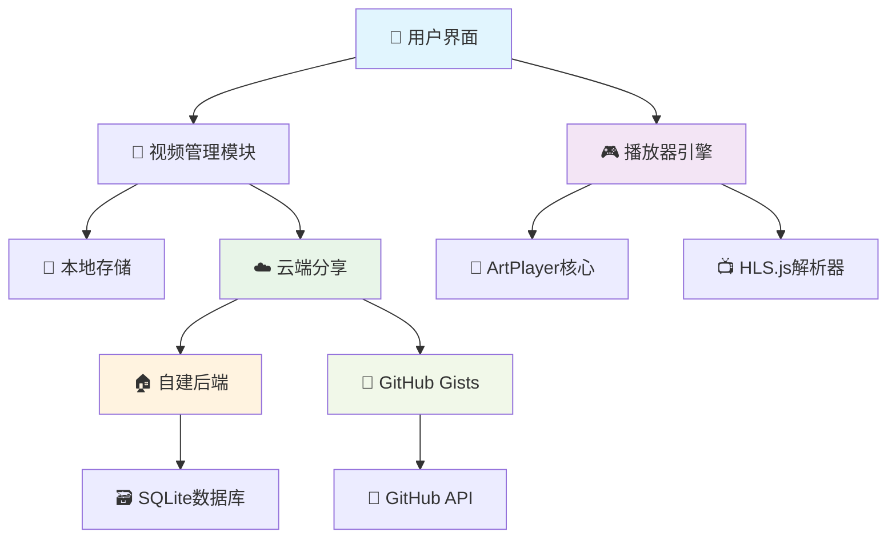

# 青云播 - 现代化云端视频播放器

<div align="center">
  
  
  <h3>🎥 现代化云端视频播放器</h3>
  <p><em>专业 · 优雅 · 智能</em></p>
  
  [](https://github.com/zhikanyeye/video)
  [](https://github.com/zhikanyeye/video)
  [](LICENSE)
  [](https://nodejs.org/)
  [](https://github.com/zhikanyeye/video)
</div>

---

## 📖 项目概述

**青云播**是一款专为现代Web环境设计的视频播放器解决方案，集成了先进的云端分享技术和优雅的用户界面。项目采用渐进式Web应用(PWA)架构，支持离线使用，为用户提供原生应用级别的流畅体验。

### 🎯 设计理念

- **🌊 流畅体验**: 基于现代Web标准，提供60fps流畅播放体验
- **☁️ 云端优先**: 创新的双云端架构，满足不同场景需求
- **🎨 美观界面**: 遵循Material Design规范，支持深色/浅色主题
- **📱 移动优先**: 响应式设计，完美适配各种设备尺寸
- **🔧 开发友好**: 模块化架构，易于扩展和二次开发
- **🔒 隐私保护**: 本地存储优先，用户数据完全可控

### 🏗️ 技术架构



## ✨ 核心特性

### 🎬 强大的播放能力

<div align="center">

| 特性 | 描述 | 支持格式 | 状态 |
|------|------|----------|------|
| **�️ 多格式播放** | 支持主流视频格式无损播放 | MP4, WebM, AVI, MOV, MKV | ✅ 完整支持 |
| **📡 流媒体播放** | 自适应码率流媒体播放 | M3U8, DASH, HLS | ✅ 完整支持 |
| **📻 直播支持** | 实时流媒体播放 | RTMP, WebRTC, FLV | ✅ 完整支持 |
| **📝 字幕支持** | 多语言字幕显示 | SRT, VTT, ASS | ✅ 完整支持 |
| **�️ 音轨切换** | 多音轨选择和切换 | 多语言音轨 | ✅ 完整支持 |
| **📱 移动适配** | 触摸手势和移动优化 | 所有移动设备 | ✅ 完整支持 |

</div>

### ☁️ 创新云端分享

青云播提供两种云端分享方案，满足不同用户需求：

#### 🏠 自建后端方案
```javascript
// 🌟 特点：完全自主控制
✅ 零配置一键启动      🚀 3秒内完成部署
✅ 本地数据存储        🔒 数据完全掌控
✅ 毫秒级响应速度      ⚡ 极致性能体验
✅ 完整访问统计        📊 详细数据分析
✅ 支持自定义域名      🌐 专业品牌形象
✅ 离线模式支持        📴 无网络也能用
```

#### 🐙 GitHub Gists方案
```javascript
// 🌟 特点：全球云端同步
✅ 永久免费云端存储    💰 零成本使用
✅ 全球CDN加速访问    🌍 毫秒级响应
✅ Git版本控制管理    📈 完整修改历史
✅ 多设备实时同步      📱 随时随地访问
✅ 一键生成分享链接    🔗 便捷分享体验
✅ 支持私有分享       🔐 灵活权限控制
```

### 🎛️ 专业播放控制

<div align="center">

| 控制类型 | 功能详情 | 快捷键 |
|----------|----------|--------|
| **🎵 音频控制** | 音量调节、静音切换、音轨选择 | `↑↓` 调节音量，`M` 静音 |
| **🖼️ 视频控制** | 画质选择、全屏播放、画中画模式 | `F` 全屏，`P` 画中画 |
| **⏯️ 播放控制** | 倍速播放、精确跳转、播放模式 | `空格` 播放/暂停，`←→` 快进/快退 |
| **📱 手势支持** | 滑动调节、双击暂停、捏合缩放 | 触摸屏设备全手势支持 |
| **⌨️ 快捷键** | 完整的键盘快捷键体系 | 支持自定义快捷键 |

</div>

## 📁 项目架构

```
video-master/
├── assets/                  # 静态资源文件
│   ├── logo.svg            # 项目Logo
│   ├── favicon.svg         # 网站图标
│   └── favicon-16.svg      # 小尺寸图标
├── backend/                # 后端服务目录
│   ├── server.js           # Node.js服务器
│   ├── package.json        # 后端依赖配置
│   └── data/               # 数据存储目录
├── scripts/                # JavaScript脚本
│   ├── main.js             # 主页面逻辑
│   ├── player.js           # 播放器逻辑
│   ├── gist-manager.js     # GitHub Gists管理
│   ├── improved-gist-manager.js # 增强版Gist管理
│   └── github-auth.js      # GitHub授权模块
├── styles/                 # CSS样式文件
│   ├── main.css            # 主样式文件
│   └── player.css          # 播放器样式
├── index.html              # 视频管理中心
├── player.html             # 专业播放器页面
├── share-methods.html      # 分享方式选择页面
├── start-backend.bat       # Windows后端启动脚本
├── start-backend.sh        # Linux/Mac后端启动脚本
└── README.md               # 项目说明文档
```

## 🚀 快速开始

### 📋 环境要求

<div align="center">

| 组件 | 最低版本 | 推荐版本 | 说明 |
|------|----------|----------|------|
| **Node.js** | 14.0.0+ | 18.0.0+ | JavaScript运行时环境 |
| **浏览器** | Chrome 80+ | 最新版本 | 现代浏览器支持 |
| **操作系统** | Windows 10+ | 最新版本 | 跨平台支持 |
| **内存** | 2GB+ | 4GB+ | 流畅运行需求 |
| **网络** | 1Mbps+ | 10Mbps+ | 视频流畅播放 |

</div>

### 📦 安装部署

#### 🎯 方法一：一键启动（推荐新手）

```bash
# 📥 克隆项目到本地
git clone https://github.com/zhikanyeye/video.git
cd video

# 🎬 Windows 用户（双击即可）
start-backend.bat

# 🐧 Linux/Mac 用户
chmod +x start-backend.sh
./start-backend.sh

# 🌐 浏览器访问
http://localhost:8090
```

<details>
<summary>💡 一键启动详细说明</summary>

**Windows用户**：
- 双击 `start-backend.bat` 文件即可启动
- 首次启动会自动安装依赖（约2-3分钟）
- 启动成功后会自动打开浏览器

**Linux/Mac用户**：
- 运行 `./start-backend.sh` 脚本启动
- 脚本会检查Node.js环境并自动配置
- 支持后台运行模式

</details>

#### 🛠️ 方法二：开发者模式

```bash
# 1. 📂 克隆仓库
git clone https://github.com/zhikanyeye/video.git
cd video

# 2. 📦 安装后端依赖
cd backend
npm install

# 3. 🚀 启动开发服务器
npm run dev

# 4. 🌐 访问应用
open http://localhost:8090
```

#### 🐳 方法三：Docker容器化部署

```dockerfile
# 🏗️ 构建镜像
docker build -t qingyunbo:latest .

# 🚀 运行容器
docker run -d \
  --name qingyunbo \
  -p 8090:8090 \
  -v $(pwd)/data:/app/data \
  qingyunbo:latest

# 📊 查看运行状态
docker ps | grep qingyunbo

# 🌐 访问应用
open http://localhost:8090
## 📚 使用指南

### 🎯 基础操作

#### 1. 添加视频
- **单个添加**: 点击"➕ 添加视频"，输入标题和链接
- **批量添加**: 点击"📄 批量导入"，粘贴多行视频链接
- **格式支持**: MP4、M3U8、FLV、RTMP等主流格式

#### 2. 播放控制
- `空格` - 播放/暂停
- `←→` - 快进/快退10秒
- `↑↓` - 音量调节
- `F` - 全屏切换
- `M` - 静音切换

#### 3. 云端分享

**自建数据库方式（推荐）**：
1. 确保后端服务已启动
2. 点击"分享列表"按钮  
3. 系统自动生成分享链接
4. 复制链接或扫描二维码分享

**GitHub Gists方式**：
1. 获取GitHub Personal Access Token（需要gist权限）
2. 在应用中完成GitHub授权
3. 选择"GitHub分享"创建Gist
4. 生成全球访问链接

### � 移动端使用

- 在同一WiFi下使用 `http://你的IP:8090` 访问
- 支持触摸手势：滑动调节、双击全屏
- 完美适配手机和平板设备

## 🛠️ 问题排除

### 常见问题

**视频无法播放**：
- 检查视频链接有效性
- 确认网络连接稳定
- 验证视频格式支持

**后端启动失败**：
- 检查Node.js版本 >= 14.0.0
- 确认端口8090未被占用
- 查看错误日志信息

**分享功能异常**：
- 自建后端：确认服务运行正常
- GitHub方式：验证Token权限正确

### 浏览器支持

- ✅ Chrome 80+ (推荐)
- ✅ Firefox 75+
- ✅ Safari 13+
- ✅ Edge 80+
   
   # 或者: PHP内置服务器（如果已安装PHP）
   php -S localhost:8080
   ```

2. **开始使用**: 浏览器访问 `http://localhost:8080` 即可开始使用

#### 📹 视频添加攻略
1. **单个添加模式**:
   - 💡 输入视频标题（支持中英文混合、emoji表情）
   - 🔗 粘贴视频链接（支持各大视频平台和直链）
   - 🎯 选择格式（推荐使用自动检测）
   - ➕ 点击"添加到播放列表"

2. **批量添加模式**:
   - 📝 在批量输入框中每行粘贴一个视频链接
   - 🤖 系统自动从URL提取文件名作为标题  
   - 🎭 支持混合格式批量添加
   - 🚀 一键批量导入，效率超高

3. **智能功能**:
   - 🧠 自动识别B站、YouTube、优酷等平台
   - 📊 自动提取视频元信息和封面
   - 🎨 智能判断最佳播放参数
   - 💾 支持播放列表导入导出

#### 🎬 播放体验升级
1. **基础播放**:
   - 🎯 点击任意视频立即开始播放
   - 📍 拖拽进度条精准定位
   - 🖼️ 鼠标悬停预览缩略图（支持的格式）
   - 🎚️ 实时调节音量和播放速度

2. **专业功能**:
   - ⚡ 倍速播放（0.25x - 4x），学习娱乐两不误
   - 🔄 A-B段落循环，重点内容反复观看
   - 📝 字幕文件支持，多语言无障碍  
   - 💬 弹幕系统集成，互动观看体验

3. **播放模式全覆盖**:
   - 🔀 **随机播放**: 意外发现，惊喜不断
   - 🔁 **列表循环**: 无限播放，永不停歇
   - 🔂 **单曲循环**: 经典重现，百听不厌
   - ➡️ **顺序播放**: 按序观看，逻辑清晰

#### 📂 列表管理专家
1. **组织功能**:
   - 🏷️ 拖拽排序，自由调整播放顺序
   - ✅ 批量选择，高效删除和操作
   - 🔍 实时搜索，快速定位目标视频
   - 📤 多格式导出，数据迁移无忧

2. **分类系统**:
   - 📁 创建自定义分类标签
   - ⭐ 收藏夹功能，珍藏精彩内容
   - 📈 播放历史自动记录，回顾观看轨迹
   - 🏆 智能推荐，基于观看习惯

#### ⚙️ 个性化设置  
1. **播放器定制**:
   - 🎨 多主题切换，深色/浅色任选
   - 📐 播放器尺寸和比例调整
   - 🔊 默认音量和播放速度设置
   - ⌨️ 快捷键自定义绑定

2. **网络优化**:
   - 🌐 代理服务器配置支持
   - ⏱️ 网络超时时间自定义
   - 🔄 断线自动重连机制
   - 💾 缓冲区大小智能调整

### 🔧 问题解决方案

青云播内置了完善的问题诊断和解决机制，遇到问题不用慌：

#### ❓ 常见问题快速解决

**🚫 视频无法播放怎么办？**
- ✅ 检查视频链接是否可以正常访问
- ✅ 确认网络连接稳定畅通
- ✅ 尝试在浏览器新标签页直接打开视频链接
- ✅ 检查视频格式是否受支持

**📺 M3U8直播流播放异常？**
- ✅ 确认HLS.js库正常加载（检查网络连接）
- ✅ 验证服务器CORS跨域策略配置
- ✅ 检查M3U8播放列表文件格式规范性
- ✅ 尝试切换不同的CDN节点

**💾 播放列表数据不见了？** 
- ✅ 检查浏览器localStorage功能是否开启
- ✅ 确认未清理浏览器数据和缓存
- ✅ 养成定期导出播放列表的好习惯
- ✅ 避免使用无痕模式长期管理数据

**⌨️ 快捷键没反应？**
- ✅ 确保播放器页面处于焦点状态
- ✅ 检查是否与浏览器内置快捷键冲突
- ✅ 先点击播放器区域再尝试快捷键
- ✅ 关闭可能干扰的浏览器扩展

#### ⚡ 性能优化秘籍

**🚀 提升播放流畅度**:
- 💻 使用有线网络连接，避免WiFi不稳定
- 🔧 关闭不必要的浏览器标签页和扩展
- 🧹 定期清理浏览器缓存释放空间
- 📱 优先选择Chrome、Edge等现代浏览器

**💾 减少内存占用**:
- 📄 避免同时打开多个播放器窗口
- 🔄 长时间使用后重启浏览器释放内存
- 🗂️ 播放列表过长时考虑分组管理
- ⚙️ 根据设备性能调整播放质量

#### 🛠️ 开发者工具

**🔍 启用调试模式**:
```javascript
// 在浏览器控制台执行以下代码
localStorage.setItem('debug', 'true');
// 刷新页面后可查看详细运行日志
```

**🔬 问题诊断步骤**:
- 🔨 按F12打开浏览器开发者工具
- 📊 查看Console选项卡的错误和警告信息
- 🌐 检查Network选项卡的网络请求状态
- 🐛 使用Sources选项卡设置断点调试

### 🌍 浏览器支持

青云播采用现代Web技术栈，在主流浏览器上都有出色表现：

#### ✨ 完美支持（推荐）
- **Chrome 88+**: 🏆 最佳性能，功能最完整，推荐首选
- **Edge 88+**: 🚀 与Chrome同源，性能卓越，兼容性佳  
- **Firefox 85+**: 🦊 开源稳定，隐私保护，体验良好
- **Safari 14+**: 🍎 Mac用户首选，主要功能完整

#### ⚠️ 基础支持
- **老版Safari (<14)**: 部分CSS3特效可能显示异常
- **Android浏览器**: 基础功能可用，建议升级到Chrome
- **iOS Safari**: 支持核心功能，部分手势可能受限
- **Internet Explorer**: ❌ 不支持，请升级到现代浏览器

### 🚀 立即开始

青云播已经为你准备就绪，现在就可以开始使用：

#### 💻 本地运行
```bash
# 确保已安装Python（大多数系统都有）
python -m http.server 8080

# 打开浏览器访问
http://localhost:8080
```

#### 📱 移动端体验  
- 📶 确保手机和电脑在同一WiFi网络
- 🔗 手机浏览器访问：`http://[电脑IP地址]:8080`
- 📲 建议使用Chrome、Safari等现代移动浏览器
- 👆 支持触摸手势，界面自适应移动端

#### 🎯 最佳实践建议
- **📁 文件组织**: 建议按类别创建不同的播放列表
- **💾 数据备份**: 定期导出播放列表，避免意外丢失
- **🌐 网络环境**: 使用稳定网络连接，确保流畅播放
- **🔒 安全意识**: 只添加来源可靠的视频链接

## 🚀 快速开始

### 方式一：使用自建数据库 (推荐)

1. **启动后端服务**
   ```bash
   # Windows用户
   双击 start-backend.bat
   
   # Linux/Mac用户
   ./start-backend.sh
   ```

2. **打开网页**
   - 在浏览器中打开 `index.html` 或访问 `http://localhost:8090`
   - 选择"自建数据库"分享方式

3. **开始使用**
   - 添加视频链接到播放列表
   - 点击"分享"按钮创建分享链接
   - 复制链接或扫描二维码分享给好友

### 方式二：使用GitHub Gists

1. **准备GitHub Token**
   - 登录GitHub，进入 [Personal Access Tokens](https://github.com/settings/tokens/new)
   - 勾选 `gist` 权限
   - 生成并复制Token

2. **配置授权**
   - 打开 `index.html`
   - 选择"GitHub Gists"分享方式
   - 在弹出窗口中输入GitHub Token

3. **开始分享**
   - 添加视频到播放列表
   - 点击"分享"创建GitHub Gist
   - 生成的链接可永久访问

### 📱 移动端使用

青云播完美支持移动端访问：

1. **本地访问**: 在同一WiFi下，使用 `http://你的IP:8090` 访问
2. **GitHub方式**: 直接使用GitHub Gists链接，随时随地访问
3. **触摸操作**: 支持手势控制，双击全屏，滑动调节

## 💡 使用技巧

### 🎯 视频管理技巧

- **批量添加**: 在"批量添加"文本框中粘贴多行视频链接
- **格式识别**: 系统会自动识别视频格式，无需手动选择
- **标题提取**: 直接粘贴网页链接，系统尝试自动提取标题
- **列表备份**: 使用"导出列表"功能定期备份播放列表

### 🎮 播放器技巧

- **快捷键控制**:
  - `空格` - 播放/暂停
  - `←/→` - 快退/快进
  - `↑/↓` - 音量调节
  - `F` - 全屏切换
  - `M` - 静音切换

- **播放模式**:
  - 🔄 顺序播放 - 按列表顺序播放
  - 🔁 循环播放 - 播放完毕重新开始
  - 🔂 单曲循环 - 重复播放当前视频
  - 🔀 随机播放 - 随机顺序播放

### ☁️ 分享技巧

- **选择合适的分享方式**:
  - 个人使用 → 自建数据库
  - 跨设备同步 → GitHub Gists
  - 公开分享 → GitHub Gists
  - 企业内网 → 自建数据库

- **分享链接格式**:
  - 自建后端: `http://domain/player.html?share=xxx`
  - GitHub Gists: `http://domain/player.html?gist=xxx`

## 🔧 高级配置

### 自建后端配置

后端服务支持环境变量配置：

```bash
# 端口配置 (默认8090)
PORT=8080

# 数据库路径 (默认./playlists.db)
DB_PATH=/path/to/database.db

# 跨域配置 (默认允许所有)
CORS_ORIGIN=https://yourdomain.com
```

### GitHub Gists配置

- **Token权限**: 仅需要 `gist` 权限，无需其他权限
- **Token安全**: Token仅存储在浏览器本地，不会上传服务器
- **Gist类型**: 创建的都是公开Gist，任何人都可以访问

## 🛡️ Security & Privacy

### 数据安全

- **本地存储**: 视频列表存储在浏览器本地，不会上传任何服务器
- **分享控制**: 用户完全控制哪些内容可以分享
- **Token安全**: GitHub Token仅存储在本地，可随时删除

### 隐私保护

- **无追踪**: 不收集任何用户行为数据
- **无广告**: 纯净体验，无任何广告内容
- **开源透明**: 所有代码开源，行为完全透明

## 🐛 常见问题

### Q: 后端服务启动失败？
A: 
1. 确保已安装Node.js (版本 ≥ 14)
2. 检查端口8090是否被占用
3. 查看控制台错误日志

### Q: GitHub授权失败？
A:
1. 检查Token是否正确复制
2. 确认Token包含 `gist` 权限
3. 检查网络连接是否正常

### Q: 视频播放失败？
A:
1. 检查视频链接是否有效
2. 确认视频格式是否supported
3. 尝试更换播放器或浏览器

### Q: 移动端访问慢？
A:
1. 确保设备在同一WiFi网络
## 🤝 贡献指南

我们欢迎所有形式的贡献！

### 贡献方式
- 🐛 报告问题和Bug
- 💡 提出新功能建议  
- 📖 改进文档
- 💻 提交代码

### 开发环境
```bash
# 克隆仓库
git clone https://github.com/zhikanyeye/video.git

# 安装依赖
cd video/backend
npm install

# 启动开发环境
npm run dev
```

## 📄 许可证

本项目基于 [MIT 许可证](LICENSE) 开源。

## 🔗 相关链接

- 🏠 [项目主页](https://github.com/zhikanyeye/video)
- 🐛 [问题反馈](https://github.com/zhikanyeye/video/issues)
- 💬 [讨论区](https://github.com/zhikanyeye/video/discussions)

---

<div align="center">
  <h3>🌟 如果这个项目对您有帮助，请给个Star！</h3>
  <p>
    <a href="https://github.com/zhikanyeye/video">
      
    </a>
  </p>
  
  <p><strong>青云播 - 让视频分享更简单 ☁️</strong></p>
  <p><em>Made with ❤️ by 青云播团队</em></p>
</div>
