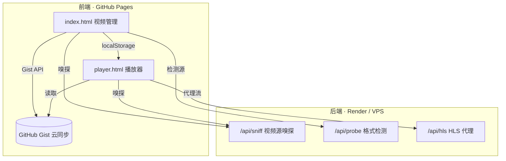

# 青云播 v2.0 - 现代化视频播放器

<div align="center">


**功能强大、界面优雅的现代化视频播放器**

支持 MP4、M3U8、FLV、DASH、MPEG-TS 等主流格式，前后端分离架构，GitHub Gist 云同步

[🚀 在线体验](https://zhikanyeye.github.io/video/) · [📖 部署指南](#-部署指南) · [🎮 快捷键](#-键盘快捷键)

</div>

---

## ✨ 核心亮点

<table>
<tr>
<td width="50%">

### 🎥 全格式播放
基于 **ArtPlayer** 引擎，集成 HLS.js / flv.js，支持 MP4、M3U8、FLV、DASH、MPEG-TS、RTMP 等主流格式，自动检测无需手动选择。HLS 默认直连+失败回退代理，FLV 启用 worker 解码不卡主线程。

</td>
<td width="50%">

### ☁️ 云端同步
通过 **GitHub Gist** 保存和分享播放列表，生成短链接即可在任意设备打开，无需注册账号，只需一个 GitHub Token。

</td>
</tr>
<tr>
<td width="50%">

### 🔍 智能检测
内置**播放源兼容性检测**与**视频源嗅探**。嗅探采用分层提取（JSON-LD / __NEXT_DATA__ / 已知播放器 / data-* / iframe），HEAD 验证带 Referer 绕过 CDN 防盗链。检测到网页地址时自动引导改用嗅探。

</td>
<td width="50%">

### 🎮 沉浸体验
键盘快捷键、播放进度记忆、**播放历史**自动记录、**倍速预设**（0.5x~2x）、**HLS 多码率手动选档**、**.vtt/.srt 字幕**支持、随机/循环/顺序多种播放模式。

</td>
</tr>
</table>

---

## 🏗️ 架构概览


```mermaid
graph TB
    subgraph 前端["前端 · GitHub Pages"]
        A["index.html 视频管理"] -->|localStorage| B["player.html 播放器"]
        A -->|Gist API| C[("GitHub Gist 云同步")]
        B -->|读取| C
    end

    subgraph 后端["后端 · Render / VPS"]
        D["/api/sniff 视频源嗅探"]
        E["/api/probe 格式检测"]
        F["/api/hls HLS 代理"]
    end

    A -->|检测源| E
    A -->|嗅探| D
    B -->|嗅探| D
    B -->|代理流| F
```

```
用户浏览器
   │
   ├─ 前端静态文件（Vite 构建）
   │    └─ GitHub Pages: https://zhikanyeye.github.io/video/
   │
   └─ 后端 API（Node.js + Express）
        └─ Render: https://your-backend.onrender.com
```

---

## 🚀 部署指南

> 推荐方案：**GitHub Pages 托管前端 + Render 托管后端**（均有免费套餐）

### 1. 部署后端（Render）

1. 在 [Render](https://render.com) 创建 **New → Web Service**
2. 关联此 GitHub 仓库，**Root Directory** 填写 `backend`
3. Build Command: `npm install`
4. Start Command: `npm start`
5. 记录生成的公网域名，例如 `https://my-qingyunbo.onrender.com`

#### 后端环境变量

| 变量 | 默认值 | 说明 |
|------|--------|------|
| `PORT` | `3000` | 监听端口（平台自动注入，无需设置） |
| `ALLOWED_ORIGINS` | — | 额外允许的 CORS 来源，逗号分隔 |
| `CORS_ALLOW_ALL` | `false` | 设为 `true` 允许所有来源（不推荐） |

> 如果你 fork 了此仓库，需在后端添加：`ALLOWED_ORIGINS=https://yourusername.github.io`

---

### 2. 配置前端环境变量

在仓库 `Settings → Secrets and variables → Actions → Variables` 中添加：

```
名称：VITE_API_BASE
值：https://my-qingyunbo.onrender.com
```

> ⚠️ 注意：这是 **Repository Variable**（不是 Secret），工作流通过 `${{ vars.VITE_API_BASE }}` 读取。

---

### 3. 启用 GitHub Pages

1. 进入仓库 `Settings → Pages`
2. Source 选择 **GitHub Actions**
3. 推送到 `master` 分支，Actions 自动构建并部署
4. 约 1~2 分钟后访问 `https://zhikanyeye.github.io/video/`

---

### 4. 本地开发

```bash
# 克隆仓库
git clone https://github.com/zhikanyeye/video.git
cd video

# 安装前端依赖
npm install

# 启动前端开发服务器（http://localhost:5173）
npm run dev

# 另开终端，启动后端（http://localhost:3000）
cd backend && npm install && npm start
```

#### 本地验收步骤

```bash
# 1. 确认前后端均已启动
# 2. 浏览器访问 http://localhost:5173
# 3. 添加一个 .mp4 或 .m3u8 链接，点击"检测源"
# 4. F12 → Network，可看到对 http://localhost:3000/api/probe 的请求
# 5. 点击播放，确认视频正常加载
```

---

## 🎬 功能详解

### 视频管理页（index.html）

- ✅ **单个添加**：输入标题 + 视频链接 + **字幕链接（可选）**，选择格式（支持自动检测）
- ✅ **批量添加**：折叠面板，每行一个链接，可在链接后加空格指定标题
- ✅ **播放源检测**：分析 HTTP 头 / CORS / M3U8 结构，定位兼容性问题；检测到网页地址时自动引导改用嗅探
- ✅ **视频源嗅探**：分层提取视频直链
  - DOM / meta / data-* 属性
  - JSON-LD VideoObject（contentUrl / embedUrl）
  - `__NEXT_DATA__`（Next.js 站点）
  - 已知播放器（JW Player / Video.js / DPlayer / ArtPlayer / Plyr）
  - Script JSON / 全局状态对象 / base64 编码
  - iframe 嵌套页面（最多跟进 2 层）
  - HEAD 验证带 Referer / Origin 头绕过 CDN 防盗链
- ✅ **播放历史**：自动记录最近 50 条播放记录，独立 tab 切换查看，支持单条删除/清空全部
- ✅ **导出列表**：导出为 JSON 文件备份
- ✅ **GitHub Gist 导入**：粘贴 Gist URL 或 ID 即可导入
- ✅ **生成分享链接**：保存到 Gist，生成可跨设备打开的播放链接

### 播放器页（player.html）

- ✅ **多格式支持**：MP4、M3U8（HLS）、FLV、DASH、MPEG-TS、iframe 嵌入
- ✅ **HLS 智能加载**：默认直连，网络错误自动回退到代理；ABR 起播带宽 1.5Mbps 起跳，按播放器尺寸限制最高码率
- ✅ **HLS 质量手动切换**：多码率 M3U8 自动解析档位（1080p / 720p / 480p），支持自动模式或手动选档
- ✅ **播放模式**：顺序 / 列表循环 / 单曲循环 / 随机（随机排除当前集）
- ✅ **倍速预设**：0.5x / 0.75x / 1x / 1.25x / 1.5x / 1.75x / 2x，点击立即生效并记忆
- ✅ **多字幕支持**：自动加载 .vtt / .srt 字幕，可在 ArtPlayer 控制条调节字幕偏移
- ✅ **进度记忆**：自动保存每个视频的播放进度，支持非 ASCII URL
- ✅ **侧边栏列表**：当前播放项左侧高亮，自动滚动到可见区域
- ✅ **设置面板**：自动播放下一集 / 标题显示进度 / HLS 代理开关 / 倍速选择 / 视频质量
- ✅ **错误处理**：播放失败时显示详细错误信息，支持重试

---

## 🎮 键盘快捷键

| 按键 | 功能 |
|------|------|
| `Space` / `K` | 播放 / 暂停 |
| `←` / `→` | 快退 / 快进 10 秒 |
| `↑` / `↓` | 音量 +10% / -10% |
| `Ctrl + ←` | 上一集 |
| `Ctrl + →` | 下一集 |
| `M` | 静音切换 |
| `F` | 全屏切换 |
| `Esc` | 退出全屏 / 关闭面板 |
| `1` – `9` | 跳转到视频 10% – 90% 位置 |
| `0` | 跳转到视频开头 |

---

## 📁 项目结构

```
video/
├── index.html                  # 视频管理页
├── player.html                 # 播放器页
├── src/
│   ├── main.js                 # 管理页逻辑
│   ├── player-main.js          # 播放器页逻辑
│   ├── player/
│   │   ├── core.js             # ArtPlayer 封装
│   │   ├── keyboard.js         # 键盘快捷键
│   │   └── playlist.js         # 播放列表 / 播放模式
│   ├── parsers/
│   │   └── video-url.js        # URL 格式解析
│   ├── components/
│   │   ├── github-manager.js   # GitHub Gist 管理
│   │   ├── modal.js            # 通用弹窗
│   │   └── toast.js            # 消息提示
│   ├── store/
│   │   └── index.js            # localStorage 状态管理
│   └── utils/
│       └── index.js            # 共享工具函数
├── styles/
│   ├── main.css                # 管理页样式
│   └── player.css              # 播放器样式
├── assets/                     # 图标资源
├── backend/
│   ├── server.js               # Express 入口
│   ├── routes/
│   │   ├── sniff.js            # 视频源嗅探（分层提取 + JSON-LD + 已知播放器 + Referer 验证）
│   │   ├── probe.js            # 格式检测（HTML 引导嗅探）
│   │   ├── hls.js              # HLS 反向代理
│   │   └── playlists.js        # 播放列表持久化（串行写锁）
│   ├── middlewares/
│   │   └── cors.js             # CORS 中间件
│   └── utils/
│       └── safe-url.js         # URL 安全校验
├── .github/workflows/
│   └── deploy.yml              # GitHub Actions 自动部署
├── vite.config.js
└── package.json
```

---

## 🌐 浏览器支持

| 浏览器 | 支持情况 |
|--------|----------|
| Chrome 88+ | ✅ 完整支持，推荐首选 |
| Edge 88+ | ✅ 完整支持 |
| Firefox 85+ | ✅ 完整支持 |
| Safari 14+ | ✅ 主要功能完整 |
| iOS Safari | ⚠️ 核心功能可用，部分手势受限 |
| Internet Explorer | ❌ 不支持 |

---

## 🔧 常见问题

**嗅探没有找到视频源？**
- 嗅探仅解析静态 HTML，无法执行 JavaScript（不使用 Puppeteer）
- 页面需要登录或视频源由 JS 动态加载（XHR/fetch 异步请求）时，嗅探无法提取
- 已实现的提取层：JSON-LD、__NEXT_DATA__、已知播放器（JW Player/Video.js/DPlayer/ArtPlayer/Plyr）、data-* 属性、Script JSON、iframe（最多跟进 2 层）
- 可尝试直接粘贴视频直链，或使用浏览器开发者工具 Network 面板手动找到 m3u8/mp4 地址

**视频播放慢、起播卡顿？**
- 默认 HLS 走直连不经代理，起播更快；只在网络错误时才回退到代理
- 如需强制走代理（直连和回退都失败的特殊场景），打开播放器设置中的"始终使用 HLS 代理"
- HLS 起播带宽估计已调到 1.5Mbps，能让首帧选清晰档而不是从最低档爬坡

**视频无法播放？**
- 点击"检测源"查看兼容性报告（直链链接）
- 如果是网页 URL，会自动引导改用"嗅探视频源"
- 确认视频链接可直接在浏览器访问
- M3U8 跨域问题可在播放器设置中开启 HLS 代理

**HLS 多码率没看到质量选择器？**
- 单码率 M3U8 不会显示质量选择器（只有"自动"档没意义）
- 主清单（master playlist）才有多档，子清单（media playlist）没有
- 检测源弹窗中可以看到是否是主清单及码率档位数

**字幕无法显示？**
- 添加视频时填写字幕链接（.vtt 或 .srt）
- 字幕文件需要支持 CORS（跨域），否则浏览器会拒绝加载
- 在播放器右键菜单中可以开关字幕、调节字幕偏移

**环境变量配置后仍不生效？**
- 确认添加的是 Repository **Variable**（不是 Secret）
- 变量名必须是 `VITE_API_BASE`，区分大小写
- 重新触发一次 Actions 构建

**本地开发时 API 请求失败？**
- 确认后端已在 `http://localhost:3000` 运行
- 本地环境会自动回退到 `localhost:3000`，无需配置

---

## 📄 License

MIT © [zhikanyeye](https://github.com/zhikanyeye)

---

<div align="center">

**如果青云播对你有帮助，欢迎点个 Star ⭐**

</div>
